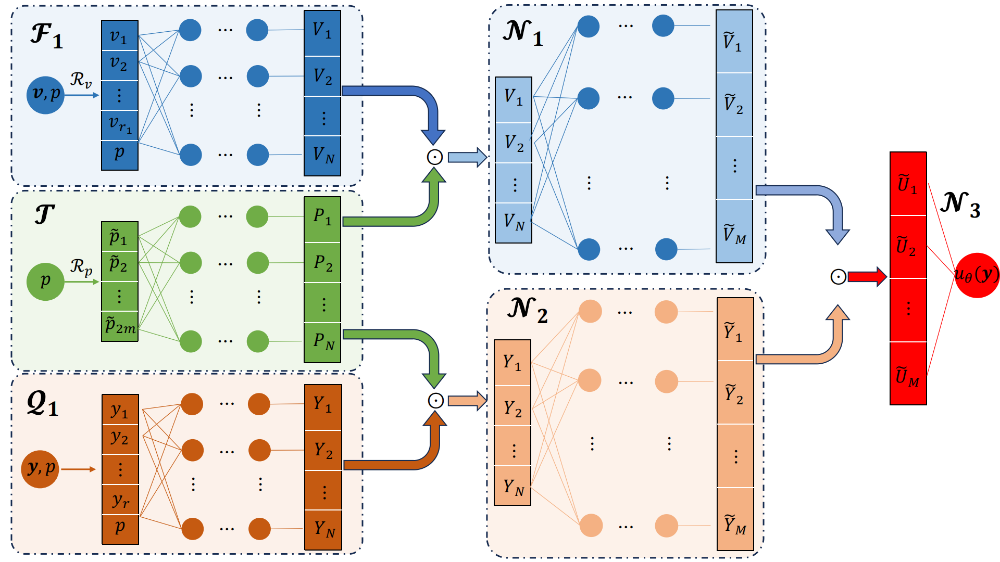
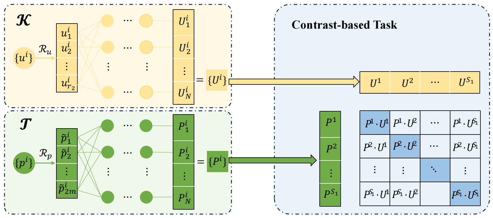
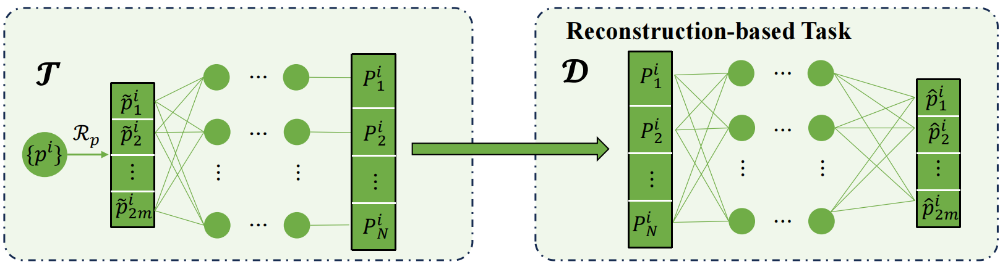
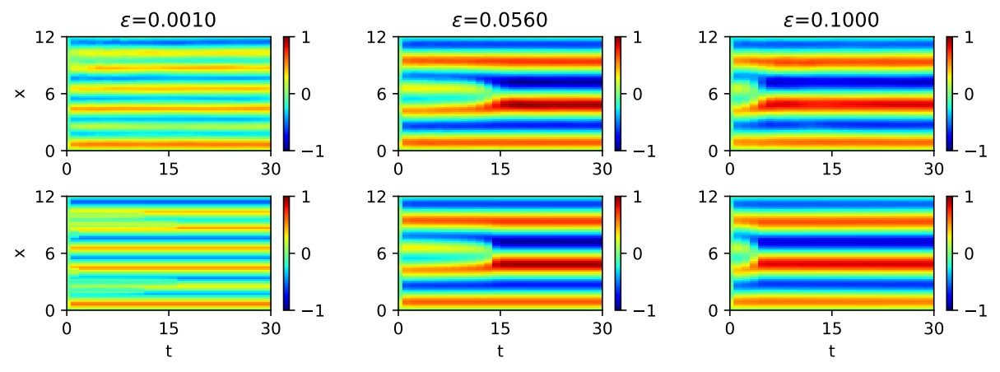

# PPFNet: A Parameter-guided Operator Network for Solving Phase Field Equations

> A reference code library for our paper PPFNet: A Parameter-guided Operator Network for Solving Phase Field Equations on ICIC 2025.

Our model architecture:


Pre-training parts: 



```
    python train_1dode_pponet.py
```

> A predicted result:


